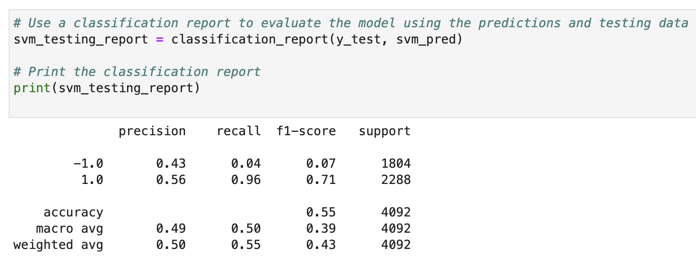
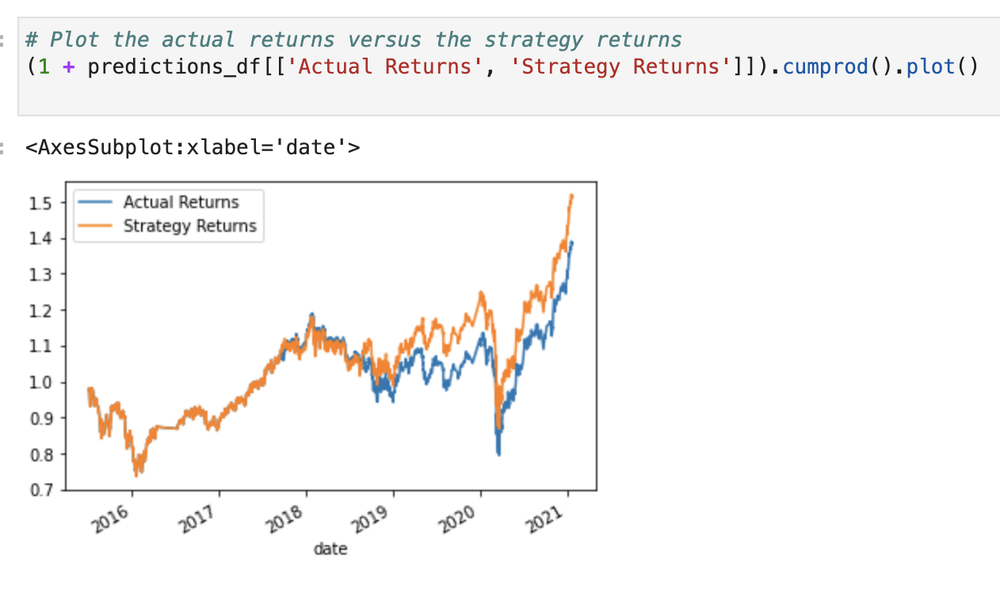
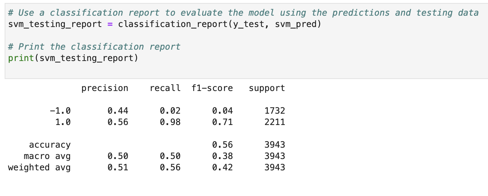
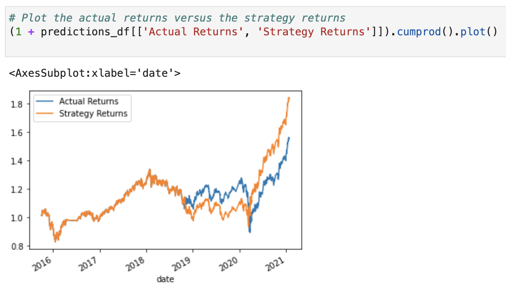
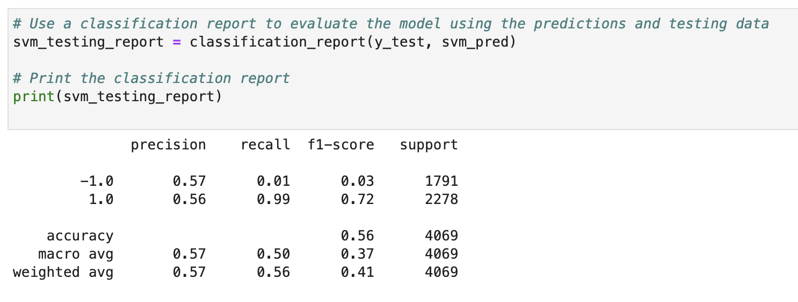
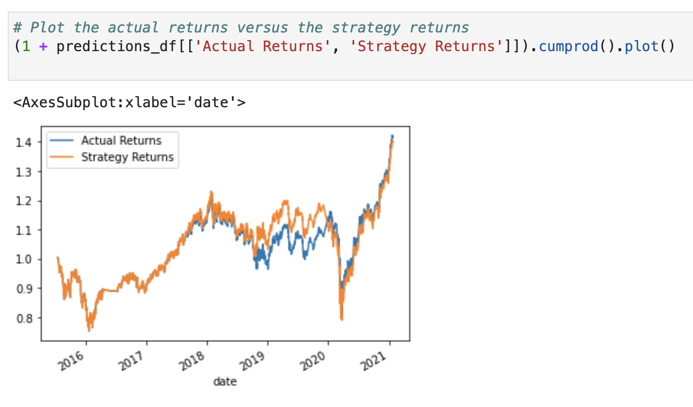
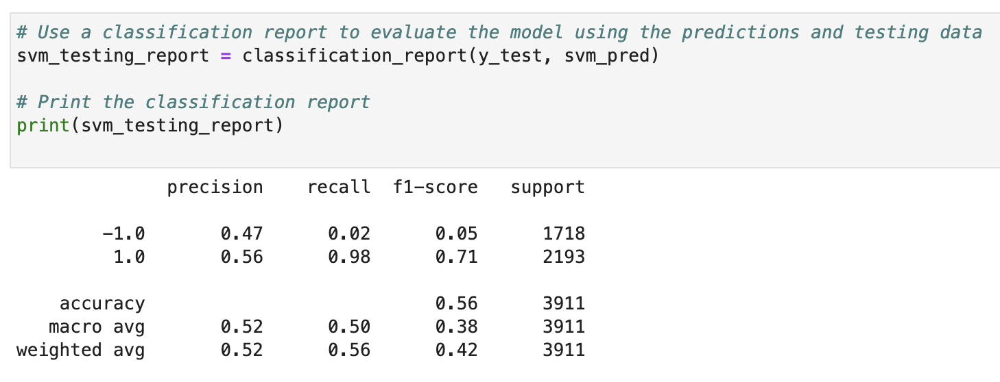
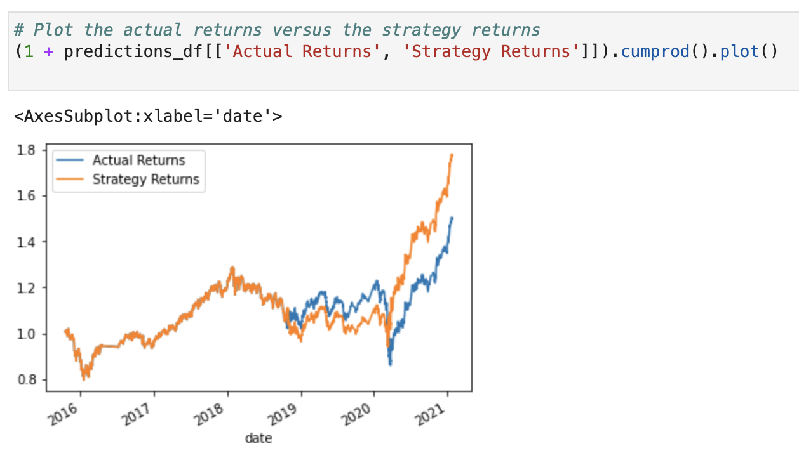
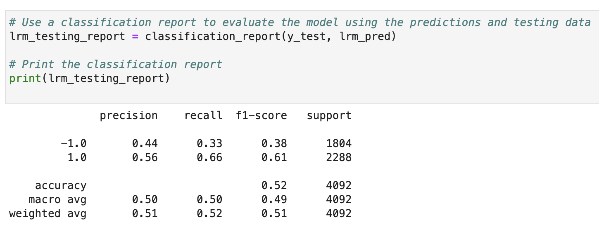
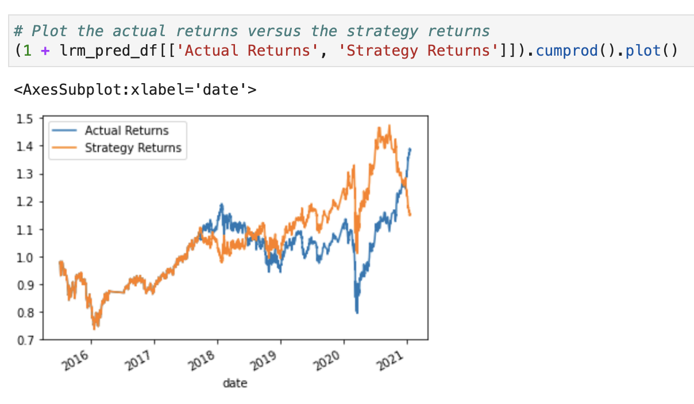

# Algorithmic_Trading

The purpose of this project was to develop a machine learning model to be integrated into an algorithmic trading bot. This would improve our algorithm by adding the ability to adapt to new data, and use machine learning to predict buy and sell signals, allowing our financial firm to maintain its competitive advantage in the market. In order to achieve this goal, we began by establishing the baseline performance for our trading algorithm based on short and long moving averages of an asset's close price, and the length of time used to train the model. We then tuned these parameters, generated a classification report, and plotted the asset's actual returns against our strategy returns, which incorporated buy and sell signals determined by the SVC classifier model from SKLearn. Finally, we evaluated a second machine learning classifier, the LogisticRegression model using the original parameters. 

Precision = True Positives / (True Positives + False Positives)

Recall = True Positives / (True Positives + False Negatives)

## The following images represent the baseline performance of our algorithmic trading bot: 

## The following images represent the performance of the trading bot using 6 months of data to train the model:

By increasing the training window to 6 months we provided the machine learning model with more information and thus improved its performance. This is evident as the precision score for the sell signal and the recall score for the buy signal both improved. The plot shows greater returns for the 6 month model as well.  

## The following images represent the performance of the trading bot after changing the short and long SMA windows to 25 and 150 respectively:

By changing the moving average windows, the model's performance was improved. This is reflected by the increase in the sell signal's precision score and the buy signals recall score. 

## The following images represent the performance of the trading bot after changing both parameters:

## The following images represent the performance of the trading bot using the LogisticRegression machine learning model:

Although the classification report indicates that overall, the SVM model performed better than the LogisticRegression model, the plot shows that the model underperformed towards the end, until then the LogisticRegression model was comparable to the SVM model.
